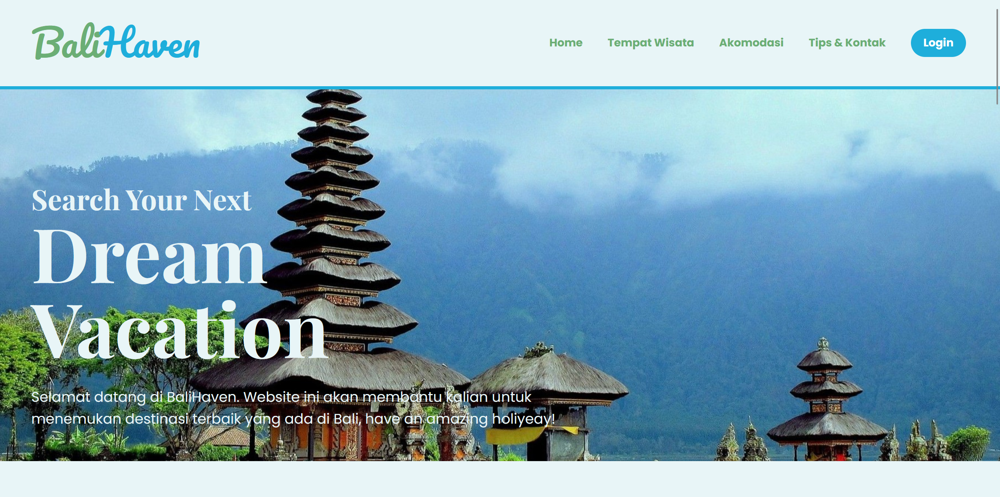
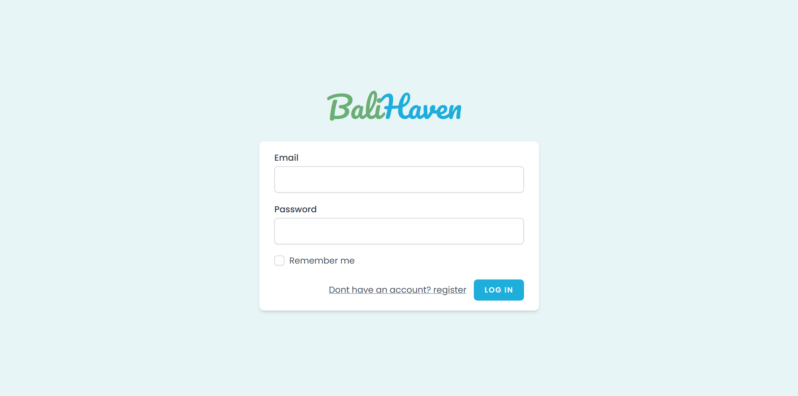

# 🏝️ BaliHaven

Aplikasi web pariwisata berbasis **Laravel** yang dirancang untuk membantu wisatawan menemukan destinasi liburan impian, akomodasi, dan tips perjalanan di Bali. Project ini dibuat untuk memenuhi tugas **UAS - Pemrograman Web Framework (PWF)**.

---

## 🎯 Fitur Utama

- ✅ **Beranda Imersif:** Tampilan Hero section dengan visual pemandangan Bali yang menarik.
- ✅ **Pencarian Destinasi:** Memudahkan pengguna mencari lokasi wisata populer.
- ✅ **Sistem Autentikasi:** Fitur Login dan Register untuk akses pengguna.
- ✅ **Katalog Wisata & Akomodasi:** Informasi lengkap tempat wisata dan penginapan.
- ✅ **Desain Responsif:** Tampilan optimal di Desktop & Mobile (menggunakan Tailwind CSS).
- ✅ **Manajemen Data:** Terintegrasi dengan database MySQL.

---

## 📸 Tampilan Aplikasi

**1. Dashboard / Halaman Utama**

**2. Halaman Login**

---

## 📁 Struktur Folder Project

Berikut adalah struktur direktori utama dalam repository ini:

BaliHaven/
├── app/                 # Logika inti (Controllers, Models)
├── bootstrap/           # Script startup framework
├── config/              # Konfigurasi aplikasi
├── database/            # Migrations & Seeds
├── public/              # File publik (index.php, images, assets)
├── resources/           # Frontend (Views Blade, CSS, JS)
│   ├── css/
│   ├── js/
│   └── views/
├── routes/              # Routing URL (web.php)
├── storage/             # Penyimpanan file upload & cache
├── tests/               # Testing folder
├── .env                 # Pengaturan Environment (DB, Key)
├── artisan              # CLI Laravel
├── composer.json        # Dependensi PHP
├── package.json         # Dependensi JavaScript (Tailwind/Vite)
├── tailwind.config.js   # Konfigurasi Tailwind
└── vite.config.js       # Konfigurasi Vite

---

## 🛠️ Teknologi yang Digunakan

- **Backend:** Laravel (PHP Framework)
- **Frontend:** Tailwind CSS & Blade Templates
- **Build Tool:** Vite
- **Database:** MySQL

---

## 🚀 Cara Menjalankan Project

1. **Clone Repository**
   git clone https://github.com/username-anda/balihaven.git
   cd balihaven

2. **Install Dependensi**
   composer install
   npm install

3. **Setup Environment**
   - Copy file .env.example menjadi .env
   - Sesuaikan konfigurasi database (DB_DATABASE, dll) di file .env

4. **Migrasi Database & Run**
   php artisan key:generate
   php artisan migrate

5. **Jalankan Server**
   Buka dua terminal berbeda dan jalankan:
   php artisan serve
   npm run dev

---

**Created by [Nama Anda]**